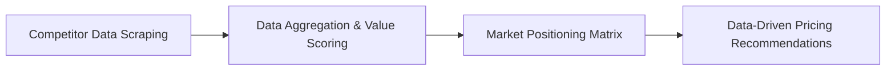

## 📊 Task 4: Competitor Benchmarking Dashboard
Analyzed market pricing, course offerings, and engagement metrics against industry competitors to formulate data-driven pricing strategies.

```mermaid
graph LR
    A[Competitor Data Scraping] --> B[Data Aggregation & Value Scoring]
    B --> C[Market Positioning Matrix]
    C --> D[Data-Driven Pricing Recommendations]
```