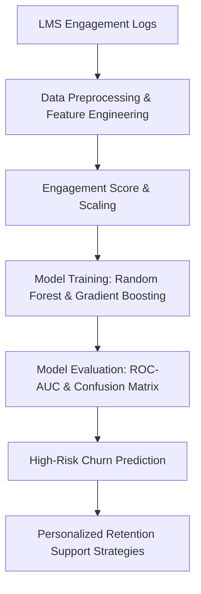

# 📊 LMS User Churn Prediction Model

A Machine Learning project to predict user churn on Learning Management Systems (LMS) using engagement logs and automated retention strategies.

## 🏗️ Project Architecture



## 🚀 How to Run
```bash
python churn_prediction_model.py
```