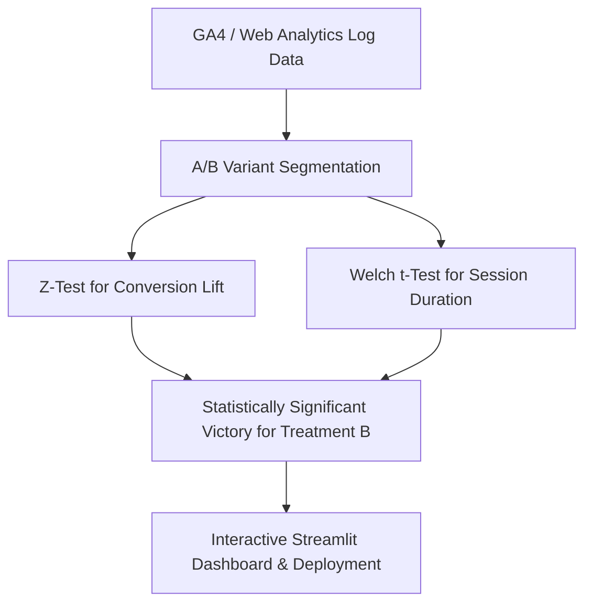

## 🧪 Task 5: A/B Testing & Website Optimization Engine

Implemented statistical hypothesis testing framework to analyze homepage redesign variations using conversion rate Z-tests and session duration Welch t-tests.

### Key Statistical Results:
* **Conversion Rate Lift:** +25.7% relative increase (Control: 10.5% → Treatment: 13.2%, `p < 0.001`)
* **Bounce Rate Reduction:** -15.5% drop in bounce rate on Treatment variant.
* **Avg Session Duration:** Increased by 25 seconds per user.